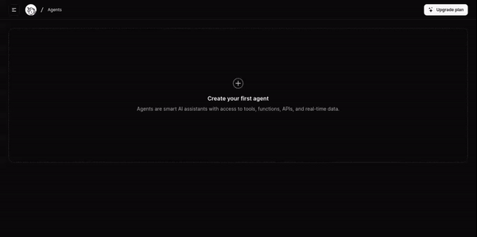
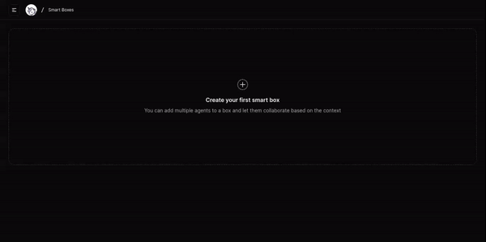

<iframe width="560" height="315" src="https://www.youtube.com/embed/T9f7-x0EMyI?si=3a_LbPdR4CMVHkxI" title="YouTube video player" frameborder="0" allow="accelerometer; autoplay; clipboard-write; encrypted-media; gyroscope; picture-in-picture; web-share" referrerpolicy="strict-origin-when-cross-origin" allowfullscreen></iframe>

<Steps>
  <Step title="Create your account">
    Visit the [Scoopika platform](https://scoopika.com/app) and sign up using your Google or Github account.
  </Step>
  <Step title="Create your first agent">
    Creating a new agent is a breeze. Simply provide a name, optional description, avatar, and a system prompt to guide its behavior. You can even generate agent avatars using AI directly from the platform. [learn more about system prompts]().

    <Tip>Choose the LLM that will drive the agent from a selection of available hosts and models.</Tip>

    <Frame>
      
    </Frame>
  </Step>

  <Step title="Generate token">
    Generate an access token to be able to use Scoopika in your applications

    <Warning>Remember to keep your tokens secure and never expose them to the public or client-side.</Warning>

    <Frame>
      
    </Frame>
  </Step>
  <Step title="Intialize Scoopika">
    First, install the Scoopika package:

```bash
npm i @scoopika/scoopika
```

    Then initialize a Scoopika instance:

```typescript
import { Scoopika, Agent } from "@scoopika/scoopika";

const scoopika = new Scoopika({
  token: "YOUR_SCOOPIKA_TOKEN",
  engines: {
    openai: "YOUR_OPENAI_KEY"
  }
});
```

    Notice that We added `openai` to our engines because We're using OpenAI's gpt-3.5 in this example (default option). You should setup your engines based on the LLMs providers or hosts your agents use, so if your agents use openai it would be:
```typescript
engines: {
  openai: "YOUR_OPENAI_KEY"
}
```

    But if they use Fireworks:

```typescript
engines: {
  fireworks: "YOUR_FIREWORKS_KEY"
}
```

    And if some of them use OpenAI and others use Fireworks, it would be like this:

```typescript
engines: {
  openai: "YOUR_OPENAI_KEY",
  fireworks: "YOUR_FIREWORKS_KEY"
}
```

    [learn more about engines](/packages/ts/scoopika/scoopika).
  </Step>

  <Step title="Run the agent">
    
    Now utilize the agent and make the first run:

```typescript
const agent = new Agent("AGENT_ID", scoopika);

(async () => {
  const response = await agent.run({
    inputs: {
      message: "Hello"
    }
  });

  console.log(response);
})();
```

    To run agents on the client-side you need to add Scoopika to one of your API routes. It's an easy process that takes few moments, check [Scoopika the the web](/guides/scoopika-for-the-web) for more info based on the framework you're using.
    
  </Step>

</Steps>